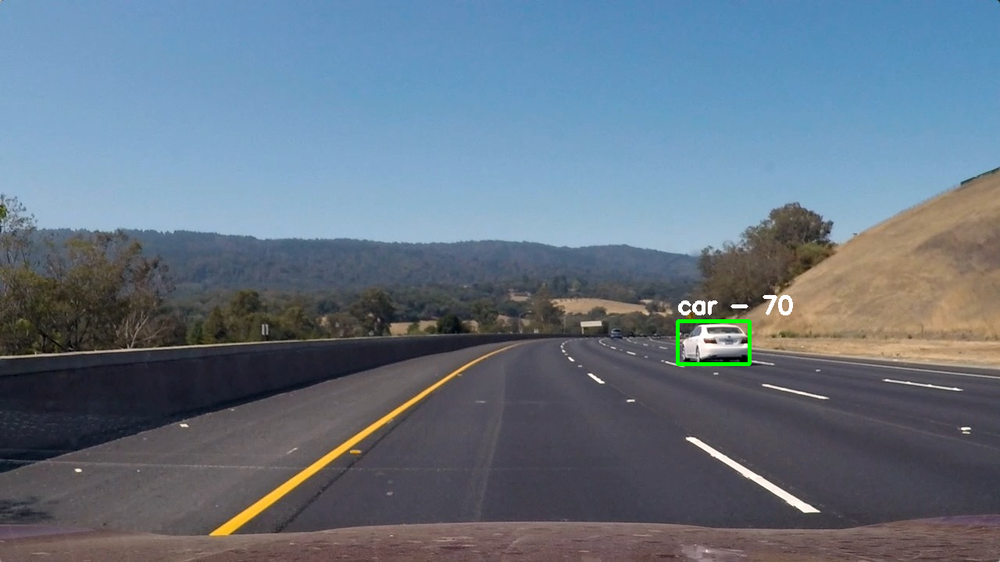

## Vehicle Detection Project 

[](http://www.udacity.com/drive)

****

The goal of this project is to write a software pipeline to detect vehicles in a video.

The ideal solution would run in real-time, i.e. > 25 FPS.

This project is using the Deep Learning algorithm called YOLO (v2). [YOLO](https://pjreddie.com/darknet/yolo/) is a clever neural network for doing object detection in real-time.

**Please Note**: I have not used HOG+SVM for this project. However, I am fulfilling all the technical rubric points, just by another method than HOG+SVM. I saw on the forum/slack that other students used other techniques, it was stated in the lesson that we were encouraged to experiment with other classifiers and my mentor said I could as long as I was clearly stating it and delivering a write up explaining my method.

The steps are the following:

* Use YOLO to detect objects.
* Select only detected objects having confidence higher than a set threshold.
* Perform Non-Maximum-Suppression to keep only one detection by detected object, thanks to another set threshold.
* Only select cars in the remaining detected objects.
* Run the pipeline on test images.
* Run the pipeline on a video stream.
* Estimate a bounding box for vehicles detected.

## Dependencies

For that project, I updated my environment, and I'm using Keras 2.1.2 and Tensorflow 1.4.1.

Here is how to set up the same environment than me.

- Set up environment

```
conda env create -f environment.yml
```

or to be able to run `VideoCapture` OpenCV code (ffmpeg and OpenCV installed) (see [Conda-forge opencv-feedstock](https://github.com/conda-forge/opencv-feedstock) for the Conda OpenCV with ffmpeg/VideoCapture enabled)

```
conda env create -f environment-opencv.yml
```

- Activate environment

```
source activate yolo carnd-term1-Keras2
```

## Usage

- Download YOLO-VOC weight file and place it in `model_data` directory

```
https://pjreddie.com/media/files/yolo-voc.weights
```

- Convert `.weight` file to `.h5` file

```
python yad2k.py model_data/yolo-voc.cfg model_data/yolo-voc.weights model_data/yolo-voc.h5 -p
```

Alternatively, you can download the  `.weights` and`.h5` weights file as well as the`.h5` model file (not needed) here :

```
https://drive.google.com/open?id=1ftYxHAI-SVFcvItcr6B9-rS1XnNDlUyL
```

- Detect objects in a given image using  YOLOv2 by running the Jupyter Notebook file 

```
jupyter notebook vehicle_detection.ipynb
```

---

## [Rubric Points](https://review.udacity.com/#!/rubrics/513/view) 

### Provide a Writeup / README that includes all the rubric points and how you addressed each one.   

You're reading it!

### Chosen method : YOLO

#### Object Detection state of the art

Classic computer vision detection systems repurpose classifiers or localizers to perform detection. They apply the model to an image at multiple locations and scales. High scoring regions of the image are considered detections. This is the case of the HOG+SVM method.

In the last years, Convolutional Neural Networks demonstrated to be very successful for object detection. That's why I was curious to test a deep learning approach to detect vehicles.

Here a graph showing the result of the Pascal VOC Challenge in the past years (Slide credit: [Renjie Liao](http://www.cs.toronto.edu/~urtasun/courses/CSC2541/05_2D_detection.pdf)):


You can take a classifier like [VGGNet](http://machinethink.net/blog/convolutional-neural-networks-on-the-iphone-with-vggnet/) or [Inception](https://github.com/hollance/Forge/tree/master/Examples/Inception) and turn it into an object detector by sliding a small window across the image. At each step you run the classifier to get a prediction of what sort of object is inside the current window. Using a sliding window gives several hundred or thousand predictions for that image, but you only keep the ones the classifier is the most certain about.

This approach works but it’s obviously going to be very slow, since you need to run the classifier many times. A slightly more efficient approach is to first predict which parts of the image contain interesting information — so-called *region proposals* — and then run the classifier only on these regions. The classifier has to do less work than with the sliding windows but still gets run many times over.

Finally, I decided to use YOLOv2 that seems to be one of the best methods, taking into account speed and accuracy (Image credit: [Joseph Redmon , Ali Farhadi](https://arxiv.org/abs/1612.08242))


YOLO takes a completely different approach. It’s not a traditional classifier that is repurposed to be an object detector. YOLO actually looks at the image just once (hence its name: You Only Look Once) but in a clever way.

#### YOLO

YOLO (or You Only Look Once) is an object detection pipeline based on a Neural Network. It uses the following approach. A single neural network is applied to the full image. This network divides the image into regions and predicts bounding boxes and probabilities for each region. These bounding boxes are weighted by the predicted probabilities. Since the whole detection pipeline is a single network, it can be optimized end-to-end directly on detection performance.


This model has several advantages over classifier-based systems. It looks at the whole image at test time so its predictions are informed by global context in the image. It also makes predictions with a single network evaluation unlike systems like [R-CNN](https://github.com/rbgirshick/rcnn) which require thousands for a single image.

YOLOv2 uses a few tricks to improve training and increase performance. Like Overfeat and SSD, it uses a fully-convolutional model, but it is still trained on whole images, not hard negatives. Like Faster R-CNN, it adjust priors on bounding boxes instead of predicting the width and height outright. However, it still predicts the `x` and `y` coordinates directly. 

##### Details of the YOLO pipeline

Source : [Matthijs Hollemans](http://machinethink.net/blog/object-detection-with-yolo/)

This explanation uses the hypothese that we use a YOLOv2 network of size of 416 by 416.

YOLO divides up the image into a grid of 13 by 13 cells (as YOLOv2 has a receptive field of 32 and 416/32 = 13):


Each of these cells is responsible for predicting 5 bounding boxes. A bounding box describes the rectangle that encloses an object.

YOLO also outputs a *confidence score* that tells us how certain it is that the predicted bounding box actually encloses some object. This score doesn’t say anything about what kind of object is in the box, just if the shape of the box is any good.

The predicted bounding boxes may look something like the following (the higher the confidence score, the fatter the box is drawn):


For each bounding box, the cell also predicts a *class*. This works just like a classifier: it gives a probability distribution over all the possible classes. The version of YOLO we’re using is trained on the [PASCAL VOC dataset](http://host.robots.ox.ac.uk/pascal/VOC/), which can detect 20 different classes such as: bicycle, boat, car, cat, dog, person,…

The confidence score for the bounding box and the class prediction are combined into one final score that tells us the probability that this bounding box contains a specific type of object. For example, the big fat yellow box on the left is 85% sure it contains the object “dog”:


Since there are 13×13 = 169 grid cells and each cell predicts 5 bounding boxes, we end up with 845 bounding boxes in total. It turns out that most of these boxes will have very low confidence scores, so we only keep the boxes whose final score is higher than a set threshold (you can change this threshold depending on how accurate you want the detector to be).

The final prediction is then:


From the 845 total bounding boxes we only kept these three because they gave the best results. But note that even though there were 845 separate predictions, they were all made at the same time — the neural network just ran once. And that’s why YOLO is so powerful and fast.

#### Model

The deep learning network for prediction is composed of convolution layers of stride 1 and a 3×3 kernel, and max-pooling layers of stride 2 and 2×2 kernel. As well as Batch Normalization and Leaky ReLu layers.

There is no fully-connected layer in YOLOv2; the input size of the network can therefore be modified, enabling a trade-off between detection quality and inference speed.

For this project, the input size of the network has been set to 416 by 416, the default size of the YOLOv2 model.

Here is the YOLOv2 neural network model :


The very last convolutional layer has a 1×1 kernel and exists to reduce the data to the shape 13×13×125. This 13×13 should look familiar: that is the size of the grid that the image gets divided into.

125 corresponds to the 20 classes of the PASCAL VOC dataset.

So we end up with 125 channels for every grid cell. These 125 numbers contain the data for the bounding boxes and the class predictions. Why 125? Well, each grid cell predicts 5 bounding boxes and a bounding box is described by 25 data elements:

- x, y, width, height for the bounding box’s rectangle (These numbers are relative to the cell they're in and have to be scaled to be represented on the entire image)
- the confidence score (This doesn't tell you anything about the shape of the box, or what's in it, just whether there is something there)
- the probability distribution over the 20 classes

Using YOLO is simple: you give it an input image (resized to 416×416 pixels), it goes through the convolutional network in a single pass, and comes out the other end as a 13×13×125 tensor describing the bounding boxes for the grid cells. All you need to do then is compute the final scores for the bounding boxes and throw away the ones scoring lower than a set threshold.

Putting it all together for an example of 5 anchors and 20 object classes, the output of the network at each position can be decomposed into 3 parts (Credit image: [Christopher Bourez](https://christopher5106.github.io/object/detectors/2017/08/10/bounding-box-object-detectors-understanding-yolo.html)):


#### Implementation

Originally YOLO is coded in C language but I found a [YAD2K, a Keras version of YOLO](https://github.com/allanzelener/YAD2K) and I revised it (mainly took out the inference part of the code, and changed it to load weights instead of the full model, so to instantiate the model by code).

#### Weights/Training

It could be possible to train ourselves the network to detect objects cars, or other objects useful for our use case (cars, buses, pedestrians, bicycles,...) but it wasn't necessary, as I was able to use the pretrained weights of YOLOv2 provided by the author of the algorithm on [its website](https://pjreddie.com/darknet/yolo/) and that have been trained on the PASCAL VOC 2007+2012 dataset (one of the classes that these weights has been trained on being `car`). 

- Download YOLO-VOC weights file and place it in `model_data` directory

```
https://pjreddie.com/media/files/yolo-voc.weights
```

- Convert `.weights` file to `.h5` file using  `yad2k` 

```
python yad2k.py model_data/yolo-voc.cfg model_data/yolo-voc.weights model_data/yolo-voc.h5 -p
```

Alternatively, you can download the  `.weights` and`.h5` weights file as well as the`.h5` model file (not needed) here, and place them in  `model_data` directory :

```
https://drive.google.com/open?id=1ftYxHAI-SVFcvItcr6B9-rS1XnNDlUyL
```

---

### Video Implementation

#### 1. Provide a link to your final video output.  Your pipeline should perform reasonably well on the entire project video (somewhat wobbly or unstable bounding boxes are ok as long as you are identifying the vehicles most of the time with minimal false positives.)
Here's a [link to my video result](https://youtu.be/KahXB67jal8) on Youtube. It is also in this project Github under the name `result_video.mp4`.

#### 2. Describe how (and identify where in your code) you implemented some kind of filter for false positives and some method for combining overlapping bounding boxes.

##### Confidence threshold

A confidence threshold is set. Only the object with a higher confidence than this threshold are considered detected objects. 

See L151-161 in `yolo.py` .

```python
def yolo_filter_boxes(boxes, box_confidence, box_class_probs, threshold=.6):
    """Filter YOLO boxes based on object and class confidence."""
    box_scores = box_confidence * box_class_probs
    box_classes = K.argmax(box_scores, axis=-1)
    box_class_scores = K.max(box_scores, axis=-1)
    prediction_mask = box_class_scores >= threshold

    boxes = tf.boolean_mask(boxes, prediction_mask)
    scores = tf.boolean_mask(box_class_scores, prediction_mask)
    classes = tf.boolean_mask(box_classes, prediction_mask)
    return boxes, scores, classes
```

##### Non-Maximum-Suppression

A Intersection Over Union (IoU) threshold is set.

During prediction time, you may have a lot of box predictions around a single object. The NMS algorithm will filter out those boxes that overlap between each other using the IoU threshold (Image credit : [leonardoaraujosantos](https://leonardoaraujosantos.gitbooks.io/artificial-inteligence/content/single-shot-detectors/yolo.html)). 


Computing the Intersection of Union is as simple as dividing the area of overlap between the bounding boxes by the area of union (Image credit: [Adrian Rosebrock](https://www.pyimagesearch.com/2016/11/07/intersection-over-union-iou-for-object-detection/)).


See L185 in `yolo.py` , use of function `image.non_max_suppression` of Tensorflow.

##### Display only cars display

I added a filter to display only the car detections. Indeed, the used weights have been trained on the PASCAL VOC dataset, composed of 20 different object. The use of this filter is not necessary on the project video and with the set thresholds, the detections are already only cars (No false detection of another object type).

See `vehicle_detection.ipynb`:

```python
def draw_car_boxes(image, boxes, score, classes):  
    for i, box in enumerate(boxes):
        if class_names[classes[i]] == 'car':
            x1 = int(box[1])
            y1 = int(box[0])
            x2 = int(box[3])
            y2 = int(box[2])
            cv2.rectangle(image,(x1,y1),( x2,y2),(0,255,0),4)
            #font = cv2.FONT_HERSHEY_SIMPLEX     
            #cv2.putText(image, class_names[classes[i]] + ' - ' + str(int(score[i]*100)) ,(x1,y1-10), font, 1,(255,255,255),3)
    return image
```
##### Box-Inside-Another-Box

Sometimes, it can happen than a box would not be deleted by using the NMS, because it is entirely contained inside another box and that the ratio between its area and the bigger one happens to be less than the IoU NMS threshold. In that case, the inside box will be deleted.

See `vehicle_detection.ipynb`:

```python
def remove_boxes_inside_another(boxes, scores, classes):
    indices = []
    nb_boxes = len(boxes)
    for i in range(nb_boxes):
        for j in range(i+1, nb_boxes):
            intersect_box = []
            intersect_box.append(max(boxes[i][0], boxes[j][0]))
            intersect_box.append(max(boxes[i][1], boxes[j][1]))
            intersect_box.append(min(boxes[i][2], boxes[j][2]))
            intersect_box.append(min(boxes[i][3], boxes[j][3]))

            if (intersect_box == list(boxes[i])):
                indices.append(i)
            if (intersect_box == list(boxes[j])):
                indices.append(j)
    if indices:
        print(indices)
        boxes = [v for i,v in enumerate(boxes) if i not in indices] 
        scores = [v for i,v in enumerate(scores) if i not in indices] 
        classes = [v for i,v in enumerate(classes) if i not in indices] 

    return boxes, scores, classes
```
##### Tracking / Time averaging / Heatmap

Adapted from [ablacklama vehicle detection project](https://github.com/ablacklama/Vehicle-Detection).

> I used a heatmap of the past 8 frames to eliminate most false detections. False detections are generally flukes and happen for only a frame or two. The heatmap kept track of the total number of detections in any area of the image for the past 8 frames and if there were less than 3, I discarded that detection.

This algorithm isn't necessary here because the detection is already sufficient by itself, but I implemented it for the exercise and in the idea to continue to improve my system afterwards.

See `vehicle_detection.ipynb`:

```python
def track(self, boxes):
    if len(boxes) == 0 and len(self.history) > 0:
        self.history.popleft()
    else:
        #create blank heatmap to store the most recent boxes
        heatmap = np.zeros([720,1280], np.int)
        for box in boxes:
            # Add += 1 for all pixels inside each box
            heatmap[int(box[0]):int(box[2]), int(box[1]):int(box[3])] += 1

        #add current heatmap to deque of heatmaps
        self.history.append(heatmap)

        #make sure to only use heatmap detection if there is enough information
        if len(self.history) > 4:
            self.first_frames = False
        else: 
            self.first_frames = True

        #add heatmaps together to make full heatmap
        if not self.first_frames:
            full_heatmap = np.zeros([720,1280], np.int)
            for preheat in self.history:
                full_heatmap = np.add(full_heatmap, preheat)

            #if the center point of a box is not in an area the heatmap recognizes, remove that box
            new_boxes = []
            for box in boxes:
                y = (box[0] + box[2]) / 2
                x = (box[1] + box[3]) / 2
                if full_heatmap[int(y), int(x)] > 3:
                    new_boxes.append(box)
            return new_boxes

    return boxes
```
This could be improved to be able to smooth the position of the detected objects from one frame to the next (avoid trembling bounding boxes).

##### Region of interest

I did not define a region of interest, but it could be done to be able to run the algorithm faster and to avoid (possible) false detections in the sky.

#### Test images results

Here are example results showing bounding boxes overlaid on test images taken from the video:





---

### Processing speed

This project runs at around 13-14 FPS on a Titan X.

I also tried the C implementation of YOLOv2 and was able to obtain speeds of more than 50 FPS.

The lower fps rate in the Python/Keras version is certainly due to the fact that I am loading, preprocessing the image, making predictions and drawing on the image all sequentially. The use of threads could be indicated. Some utils functions could also be cythonized. 

In any case, this code should be able to run in real-time on a Titan X. 

Tiny YOLOv2 could be used instead of YOLOv2 to gain processing speed, and if embedded hardware had to be used.

It should also be possible to try different network architectures, such as SqueezeNet, and retrain this network to predict the bounding boxes in its last layer. In other words, to take the YOLO ideas and put them on top of a smaller and faster convnet.

---

### Discussion

#### 1. Briefly discuss any problems / issues you faced in your implementation of this project.  Where will your pipeline likely fail?  What could you do to make it more robust?

The obtained accuracy is quite satisfactory. However, being trained on adapted datasets (Udacity SDC, KITTI,...) could improve the results and enable to detect other objects of interest (pedestrians, trucks, bicycles,...).

The presented method, using Python and Keras isn't running in real-time on my Titan X. However, it does with a C implementation.

The detection could be done only on a region of interest in the image, to gain processing time and avoid (possible) false positive in the sky.

This system is able to detect more vehicles on the project video; to do that, it is only needed to lower the confidence and IoU thresholds. But I set high thresholds to only detect the 3 cars driving in the same direction than us and being near us, as my Mentor said me it was better to have the project accepted. 

##### Improvements

* Add tracking of the objects from one frame to the other (being able to follow a particular object, and smooth its bounding box).


* NMS on gpu to improve the speed (particularly is numerous objects detected).
* Use C implementation (faster) (original pjreddie or AlexeyAB (I had faster than 50 fps on a Titan X (Pascal) with this version with YOLO v2 model)).
* Use Tiny-YOLO for faster (but lower quality) results.
* Retrain with a driving dataset ([KITTI](http://www.cvlibs.net/datasets/kitti/eval_object.php), [Udacity SDC](https://github.com/udacity/self-driving-car/tree/master/annotations),...) ([HOW-TO](https://medium.com/@vivek.yadav/part-1-generating-anchor-boxes-for-yolo-like-network-for-vehicle-detection-using-kitti-dataset-b2fe033e5807))
* Being able to use original weights file (without needing to convert them to .hd5 format)


---

### References

- [Yolo v2 paper](https://arxiv.org/abs/1612.08242)
- [Yolo v1 paper](https://arxiv.org/abs/1506.02640)
- [Yolo/Darknet website](https://pjreddie.com/darknet/yolo/)
- [Yolo/Darknet github](https://github.com/pjreddie/darknet)
- [YAD2K Keras/Tensorflow port](https://github.com/allanzelener/YAD2K)
- [Darkflow Tensorflow port](https://github.com/thtrieu/darkflow)
- [Keras port with original weights](https://github.com/datlife/yolov2)
- [Object detection with YOLO (YOLO explanation)](http://machinethink.net/blog/object-detection-with-yolo/)
- [Bounding box object detectors: understanding YOLO, You Look Only Once](https://christopher5106.github.io/object/detectors/2017/08/10/bounding-box-object-detectors-understanding-yolo.html)
- [How to train YOLO v2 with custom objects](https://timebutt.github.io/static/how-to-train-yolov2-to-detect-custom-objects/)


